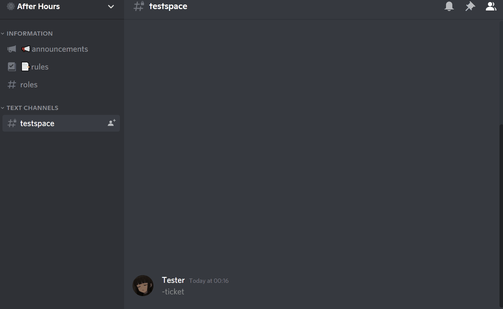
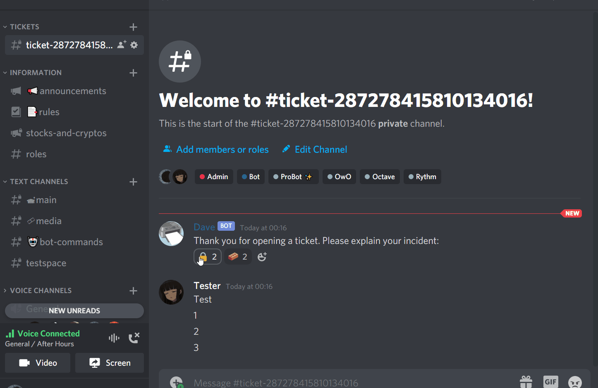

# PrinterBot
 Discord JS bot
# Commands:
## Ticket Command:
### User POV:
The user can use the command `-ticket` which will open up a support channel.  
Features:
- Can only be viewed by specified roles `(For example admin roles)`
- Can be viewed by the user who opened the channel
- Only one can be made per user
>  
### Authorised Role POV:
The authorised roles will be allowed to view this channel to deal with this incident.  
Reactions:
- By reacting to the lock emoji, the channel will stop a user from typing into that channel.
- By reacting to the brick emoji, the channel will delete itself after 7 seconds. 
>  
## Read Command:
All messages from the user within the ticket channel will be recorded into a csv database. This will allow for admins to bring up messages from incidents in the past.  
### Authorised Role POV:
By using `-read <ID> -date <date>
